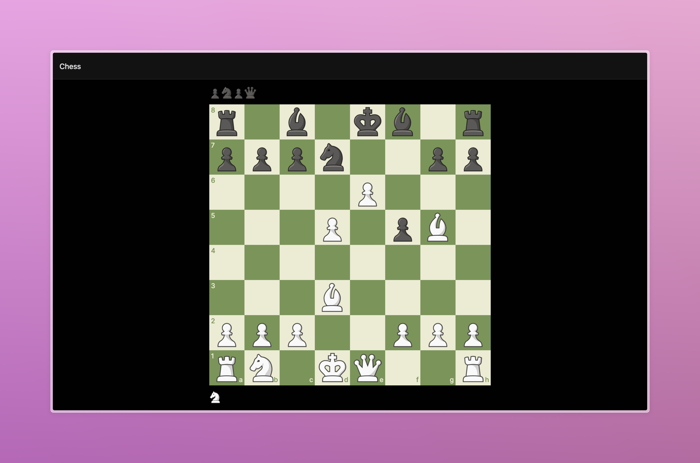

# RNChess

An open source clone of chess.com made using Expo and Tamagui.




## Note

> This project is still in development and is not yet ready for production. I invite you to contribute to this project and be the part of this open source project.

Please report any issues you find in the project. Also, feel free to contribute to the project by creating a pull request.

## Installation

```bash
npm install
```

## Usage

```bash
npm start
```

## License
[MIT](https://choosealicense.com/licenses/mit/)
